# USE CASE DIAGRAM — Sistem Administrasi Sekolah (UT Administrasi)

> Dokumen ini berisi alur Use Case lengkap beserta relasi **include**, **extend**, dan aktor.
> Gunakan dokumen ini untuk membuat diagram Use Case di tools seperti StarUML, draw.io, PlantUML, atau Lucidchart.

---

## 1. AKTOR (ACTORS)

| No | Aktor        | Deskripsi |
|----|-------------|-----------|
| 1  | **Admin**   | Tata Usaha / Administrator sekolah. Memiliki akses penuh ke semua modul sistem. |
| 2  | **Staff**   | Guru / Tenaga Kependidikan. Memiliki akses terbatas sesuai perannya. |
| 3  | **System**  | Aktor non-manusia (scheduler, auto-notification). |

---

## 2. DAFTAR USE CASE PER MODUL

### 📋 Modul A: Autentikasi & Otorisasi

| ID     | Use Case                 | Aktor          | Relasi |
|--------|--------------------------|----------------|--------|
| UC-A01 | Login                    | Admin, Staff   | **include** → UC-A03 |
| UC-A02 | Logout                   | Admin, Staff   | — |
| UC-A03 | Verifikasi Role          | System         | — |

**Deskripsi Alur:**
```
UC-A01 Login
  Aktor: Admin, Staff
  Precondition: User memiliki akun aktif
  Flow:
    1. User membuka halaman login
    2. User memasukkan email & password
    3. System memvalidasi kredensial
    4. <<include>> UC-A03: Verifikasi Role
    5. System redirect ke dashboard sesuai role (admin/staff)
  Postcondition: User berhasil masuk ke dashboard
  Alternative:
    3a. Kredensial salah → tampilkan pesan error
    3b. Akun non-aktif → tampilkan pesan akun dinonaktifkan
```

---

### 👥 Modul B: Manajemen Staff / Pegawai

| ID     | Use Case                    | Aktor  | Relasi |
|--------|-----------------------------|--------|--------|
| UC-B01 | Lihat Daftar Staff          | Admin  | — |
| UC-B02 | Tambah Staff Baru           | Admin  | **include** → UC-A03 |
| UC-B03 | Edit Data Staff             | Admin  | — |
| UC-B04 | Hapus Staff                 | Admin  | — |
| UC-B05 | Toggle Status Aktif Staff   | Admin  | — |
| UC-B06 | Export Data Staff           | Admin  | **extend** → UC-B01 |
| UC-B07 | Import Data Staff           | Admin  | **extend** → UC-B01 |
| UC-B08 | Kelola Profil Sendiri       | Staff  | — |
| UC-B09 | Ubah Password               | Staff  | **include** → UC-B08 |

**Deskripsi Alur:**
```
UC-B02 Tambah Staff Baru
  Aktor: Admin
  Precondition: Admin sudah login
  Flow:
    1. Admin membuka halaman Staff → klik "Tambah Staff"
    2. Admin mengisi form (nama, email, password, phone, position, alamat)
    3. System validasi input (email unik, password min length)
    4. System menyimpan data user baru dengan role=staff
  Postcondition: Staff baru terdaftar
  Alternative:
    3a. Email duplikat → tampilkan error validasi

UC-B06 Export Data Staff  (<<extend>> UC-B01)
  Trigger: Admin memilih opsi "Export" dari halaman daftar staff
  Flow:
    1. Admin klik tombol Export
    2. System generate file Excel/PDF berisi data staff
    3. File diunduh ke komputer admin

UC-B07 Import Data Staff  (<<extend>> UC-B01)
  Trigger: Admin memilih opsi "Import" dari halaman daftar staff
  Flow:
    1. Admin klik tombol Import → pilih file Excel
    2. System membaca dan memvalidasi data
    3. System menyimpan data staff baru secara batch
```

---

### ⏰ Modul C: Manajemen Kehadiran (Attendance)

| ID     | Use Case                       | Aktor        | Relasi |
|--------|-------------------------------|--------------|--------|
| UC-C01 | Clock In                       | Staff        | **include** → UC-C07 |
| UC-C02 | Clock Out                      | Staff        | **include** → UC-C07 |
| UC-C03 | Lihat Riwayat Kehadiran        | Staff        | — |
| UC-C04 | Tambah Catatan Kehadiran       | Staff        | **extend** → UC-C03 |
| UC-C05 | Lihat Data Kehadiran Semua     | Admin        | — |
| UC-C06 | Lihat Laporan Kehadiran        | Admin        | **include** → UC-C05 |
| UC-C07 | Validasi Lokasi GPS            | System       | — |
| UC-C08 | Atur Pengaturan Kehadiran      | Admin        | — |
| UC-C09 | Export Data Kehadiran          | Admin        | **extend** → UC-C05 |
| UC-C10 | Deteksi Keterlambatan          | System       | **include** → UC-C01 |

**Deskripsi Alur:**
```
UC-C01 Clock In
  Aktor: Staff
  Precondition: Staff sudah login, belum clock-in hari ini
  Flow:
    1. Staff membuka halaman Kehadiran → klik "Clock In"
    2. <<include>> UC-C07: System mengambil lokasi GPS
    3. System merekam foto selfie
    4. System mencatat waktu clock-in, koordinat, foto
    5. <<include>> UC-C10: System cek apakah terlambat (bandingkan dengan AttendanceSetting)
    6. Status kehadiran otomatis: 'hadir' atau 'terlambat'
  Postcondition: Data kehadiran tercatat
  Alternative:
    2a. GPS di luar jangkauan → tampilkan peringatan

UC-C08 Atur Pengaturan Kehadiran
  Aktor: Admin
  Flow:
    1. Admin buka halaman Pengaturan Kehadiran
    2. Admin atur jam masuk, jam pulang, toleransi terlambat (menit)
    3. Admin atur koordinat kantor & jarak maksimum (meter)
    4. System simpan setting
  Postcondition: Pengaturan kehadiran terupdate
```

---

### 📝 Modul D: Manajemen Cuti / Izin (Leave Request)

| ID     | Use Case                    | Aktor  | Relasi |
|--------|-----------------------------|--------|--------|
| UC-D01 | Ajukan Cuti/Izin            | Staff  | **include** → UC-K01 |
| UC-D02 | Lihat Daftar Pengajuan Cuti | Staff  | — |
| UC-D03 | Hapus Pengajuan Cuti        | Staff  | **extend** → UC-D02 |
| UC-D04 | Lihat Semua Pengajuan Cuti  | Admin  | — |
| UC-D05 | Setujui Pengajuan Cuti      | Admin  | **include** → UC-K01 |
| UC-D06 | Tolak Pengajuan Cuti        | Admin  | **include** → UC-K01 |
| UC-D07 | Lihat Detail Pengajuan      | Admin, Staff | — |

**Deskripsi Alur:**
```
UC-D01 Ajukan Cuti/Izin
  Aktor: Staff
  Precondition: Staff sudah login
  Flow:
    1. Staff buka halaman Cuti → klik "Ajukan Cuti"
    2. Staff isi form (tipe: cuti/izin/sakit, tanggal mulai, selesai, alasan)
    3. Staff upload lampiran (opsional, misal surat dokter)
    4. System simpan dengan status='pending'
    5. <<include>> UC-K01: System kirim notifikasi ke Admin
  Postcondition: Pengajuan cuti tersimpan
  Alternative:
    2a. Tanggal tidak valid → tampilkan error

UC-D05 Setujui Pengajuan Cuti
  Aktor: Admin
  Precondition: Ada pengajuan dengan status pending
  Flow:
    1. Admin buka detail pengajuan cuti
    2. Admin klik "Setujui" dan isi catatan (opsional)
    3. System update status='approved', simpan approved_by
    4. <<include>> UC-K01: System kirim notifikasi ke Staff terkait
  Postcondition: Status cuti berubah menjadi approved
```

---

### 📊 Modul E: Manajemen Laporan (Report)

| ID     | Use Case                    | Aktor  | Relasi |
|--------|-----------------------------|--------|--------|
| UC-E01 | Buat Laporan                | Staff  | — |
| UC-E02 | Edit Laporan                | Staff  | **extend** → UC-E01 |
| UC-E03 | Hapus Laporan               | Staff  | — |
| UC-E04 | Lihat Daftar Laporan Saya   | Staff  | — |
| UC-E05 | Lihat Semua Laporan         | Admin  | — |
| UC-E06 | Update Status Laporan       | Admin  | **include** → UC-K01 |
| UC-E07 | Lihat Detail Laporan        | Admin, Staff | — |

**Deskripsi Alur:**
```
UC-E01 Buat Laporan
  Aktor: Staff
  Precondition: Staff sudah login
  Flow:
    1. Staff buka halaman Laporan → klik "Buat Laporan"
    2. Staff isi form:
       - Judul
       - Deskripsi
       - Kategori (surat_masuk, surat_keluar, inventaris, keuangan, kegiatan, lainnya)
       - Prioritas (low, medium, high)
    3. Upload lampiran (opsional)
    4. System simpan dengan status='draft' atau 'submitted'
  Postcondition: Laporan tersimpan

UC-E06 Update Status Laporan
  Aktor: Admin
  Precondition: Ada laporan yang disubmit
  Flow:
    1. Admin buka detail laporan
    2. Admin ubah status: draft → submitted → reviewed → completed
    3. <<include>> UC-K01: System kirim notifikasi ke Staff pembuat
  Postcondition: Status laporan diperbarui
```

---

### 📅 Modul F: Manajemen Event / Kegiatan

| ID     | Use Case                 | Aktor        | Relasi |
|--------|--------------------------|--------------|--------|
| UC-F01 | Buat Event               | Admin        | **include** → UC-K01 |
| UC-F02 | Edit Event               | Admin        | — |
| UC-F03 | Hapus Event              | Admin        | — |
| UC-F04 | Lihat Daftar Event       | Admin, Staff | — |
| UC-F05 | Lihat Detail Event       | Admin, Staff | — |

**Deskripsi Alur:**
```
UC-F01 Buat Event
  Aktor: Admin
  Flow:
    1. Admin buka halaman Event → klik "Buat Event"
    2. Admin isi form:
       - Judul, Deskripsi
       - Tanggal, Waktu mulai, Waktu selesai
       - Lokasi
       - Tipe (rapat, kegiatan, upacara, pelatihan, lainnya)
       - Status (upcoming, ongoing, completed, cancelled)
    3. System simpan event
    4. <<include>> UC-K01: System kirim notifikasi ke semua staff
  Postcondition: Event tercatat dan staff diberitahu
```

---

### 🔔 Modul K: Manajemen Notifikasi

| ID     | Use Case                     | Aktor        | Relasi |
|--------|------------------------------|--------------|--------|
| UC-K01 | Kirim Notifikasi             | Admin, System| — |
| UC-K02 | Lihat Daftar Notifikasi      | Staff        | — |
| UC-K03 | Tandai Sudah Dibaca          | Staff        | **extend** → UC-K02 |
| UC-K04 | Tandai Semua Sudah Dibaca    | Staff        | **extend** → UC-K02 |
| UC-K05 | Buat Notifikasi Manual       | Admin        | **include** → UC-K01 |
| UC-K06 | Hapus Notifikasi             | Admin        | — |

**Deskripsi Alur:**
```
UC-K01 Kirim Notifikasi  (sering di-include oleh use case lain)
  Aktor: System / Admin
  Flow:
    1. Trigger event terjadi (cuti disetujui, event baru, dll)
    2. System membuat record Notification
       - user_id, title, message, type, link
    3. Notifikasi muncul di dashboard staff
  Tipe notifikasi: kehadiran, izin, event, laporan, sistem, pengumuman

UC-K05 Buat Notifikasi Manual
  Aktor: Admin
  Flow:
    1. Admin buka halaman Notifikasi → klik "Buat Notifikasi"
    2. Admin isi: judul, pesan, tujuan user, tipe
    3. <<include>> UC-K01: System kirim notifikasi
  Postcondition: Notifikasi terkirim ke user tujuan
```

---

### ✉️ Modul G: Manajemen Surat

| ID     | Use Case                     | Aktor        | Relasi |
|--------|------------------------------|--------------|--------|
| UC-G01 | Buat Surat                   | Admin, Staff | **include** → UC-G07 |
| UC-G02 | Edit Surat                   | Admin        | — |
| UC-G03 | Hapus Surat                  | Admin        | — |
| UC-G04 | Lihat Daftar Surat           | Admin, Staff | — |
| UC-G05 | Lihat Detail Surat           | Admin, Staff | — |
| UC-G06 | Update Status Surat          | Admin        | **include** → UC-K01 |
| UC-G07 | Generate Nomor Surat Otomatis| System       | — |

**Deskripsi Alur:**
```
UC-G01 Buat Surat
  Aktor: Admin / Staff
  Flow:
    1. User buka halaman Surat → klik "Buat Surat"
    2. User isi form:
       - Jenis: masuk / keluar
       - Kategori: dinas, undangan, keterangan, keputusan, edaran, tugas, pemberitahuan
       - Perihal, Isi, Tujuan/Asal
       - Tanggal Surat, Tanggal Terima, Sifat
    3. <<include>> UC-G07: System generate nomor surat otomatis
       Format: {nomor}/{SM|SK}/{kode_kategori}/TU-SMA2/{bulan}/{tahun}
    4. Upload file lampiran (opsional)
    5. System simpan dengan status='draft'
  Postcondition: Surat tersimpan dengan nomor otomatis

UC-G06 Update Status Surat
  Aktor: Admin
  Status Flow: draft → diproses → dikirim → diterima → diarsipkan
  Flow:
    1. Admin buka detail surat
    2. Admin ubah status & isi catatan
    3. System simpan approved_by
    4. <<include>> UC-K01: Notifikasi ke Staff terkait
```

---

### 📁 Modul H: Manajemen Dokumen

| ID     | Use Case                 | Aktor        | Relasi |
|--------|--------------------------|--------------|--------|
| UC-H01 | Upload Dokumen           | Admin, Staff | — |
| UC-H02 | Lihat Daftar Dokumen     | Admin, Staff | — |
| UC-H03 | Download Dokumen         | Admin, Staff | **extend** → UC-H02 |
| UC-H04 | Edit Dokumen             | Admin        | — |
| UC-H05 | Hapus Dokumen            | Admin        | — |
| UC-H06 | Export Daftar Dokumen    | Admin        | **extend** → UC-H02 |

**Deskripsi Alur:**
```
UC-H01 Upload Dokumen
  Aktor: Admin / Staff
  Flow:
    1. User buka halaman Dokumen → klik "Upload"
    2. User isi: judul, deskripsi, kategori
    3. User pilih file (PDF, DOC, XLS, PPT, gambar)
    4. System simpan file & catat metadata (ukuran, tipe, uploader)
  Postcondition: Dokumen tersimpan
  Tipe File Didukung: pdf, doc, docx, xls, xlsx, ppt, pptx, jpg, png, gif
```

---

### 📚 Modul I: Manajemen Kurikulum & Akademik

| ID     | Use Case                          | Aktor        | Relasi |
|--------|-----------------------------------|--------------|--------|
| UC-I01 | Upload Dokumen Kurikulum          | Admin        | — |
| UC-I02 | Edit Dokumen Kurikulum            | Admin        | — |
| UC-I03 | Hapus Dokumen Kurikulum           | Admin        | — |
| UC-I04 | Lihat Daftar Dokumen Kurikulum    | Admin, Staff | — |
| UC-I05 | Lihat Detail Dokumen Kurikulum    | Admin, Staff | — |
| UC-I06 | Upload Dokumen Kurikulum (Staff)  | Staff        | — |

**Deskripsi Alur:**
```
UC-I01 Upload Dokumen Kurikulum
  Aktor: Admin
  Flow:
    1. Admin buka halaman Kurikulum → klik "Upload"
    2. Admin isi form:
       - Judul, Deskripsi
       - Tipe: kalender_pendidikan, jadwal_pelajaran, rpp, silabus,
               modul_ajar, kisi_kisi, analisis_butir_soal,
               berita_acara_ujian, daftar_nilai, rekap_nilai, leger, raport
       - Tahun Akademik, Semester, Mata Pelajaran, Tingkat Kelas
    3. Upload file
    4. System simpan metadata
  Postcondition: Dokumen kurikulum tersimpan
```

---

### 🎓 Modul J: Manajemen Kesiswaan

| ID     | Use Case                     | Aktor        | Relasi |
|--------|------------------------------|--------------|--------|
| UC-J01 | Tambah Data Siswa            | Admin        | — |
| UC-J02 | Edit Data Siswa              | Admin        | — |
| UC-J03 | Hapus Data Siswa             | Admin        | — |
| UC-J04 | Lihat Daftar Siswa           | Admin, Staff | — |
| UC-J05 | Lihat Detail Siswa           | Admin, Staff | **include** → UC-J06, UC-J07 |
| UC-J06 | Lihat Prestasi Siswa         | Admin, Staff | — |
| UC-J07 | Lihat Pelanggaran Siswa      | Admin, Staff | — |
| UC-J08 | Tambah Prestasi Siswa        | Admin        | **extend** → UC-J05 |
| UC-J09 | Tambah Pelanggaran Siswa     | Admin        | **extend** → UC-J05 |

**Deskripsi Alur:**
```
UC-J01 Tambah Data Siswa
  Aktor: Admin
  Flow:
    1. Admin buka halaman Kesiswaan → klik "Tambah Siswa"
    2. Admin isi form:
       - NIS, NISN, Nama, Kelas, Tahun Akademik
       - Jenis Kelamin, Tempat/Tanggal Lahir, Agama
       - Alamat, Nama Orang Tua, No. HP Orang Tua
       - Foto, Status (aktif, mutasi_masuk, mutasi_keluar, lulus, do)
       - Tanggal Masuk
    3. System simpan data siswa
  Postcondition: Data siswa tersimpan

UC-J05 Lihat Detail Siswa
  Aktor: Admin, Staff
  Flow:
    1. User klik nama siswa dari daftar
    2. System tampilkan data lengkap siswa
    3. <<include>> UC-J06: System tampilkan daftar prestasi
    4. <<include>> UC-J07: System tampilkan daftar pelanggaran
```

---

### 🏢 Modul L: Manajemen Inventaris / Sarana Prasarana

| ID     | Use Case                        | Aktor        | Relasi |
|--------|---------------------------------|--------------|--------|
| UC-L01 | Tambah Inventaris               | Admin        | **include** → UC-L07 |
| UC-L02 | Edit Inventaris                 | Admin        | — |
| UC-L03 | Hapus Inventaris                | Admin        | — |
| UC-L04 | Lihat Daftar Inventaris         | Admin, Staff | — |
| UC-L05 | Lihat Detail Inventaris         | Admin, Staff | **include** → UC-L06 |
| UC-L06 | Lihat Laporan Kerusakan         | Admin, Staff | — |
| UC-L07 | Generate Kode Barang Otomatis   | System       | — |
| UC-L08 | Laporkan Kerusakan              | Staff        | **include** → UC-K01 |

**Deskripsi Alur:**
```
UC-L01 Tambah Inventaris
  Aktor: Admin
  Flow:
    1. Admin buka halaman Inventaris → klik "Tambah"
    2. Admin pilih kategori: mebeulair, elektronik, buku, alat_lab, olahraga, lainnya
    3. <<include>> UC-L07: System auto-generate kode barang
       Format: {prefix}-{nomor urut 4 digit} (contoh: ELK-0001)
    4. Admin isi: nama, deskripsi, lokasi, jumlah, kondisi, sumber dana, harga
    5. Admin upload foto (opsional)
    6. System simpan data
  Postcondition: Data inventaris tersimpan

UC-L08 Laporkan Kerusakan
  Aktor: Staff
  Flow:
    1. Staff buka halaman Inventaris → pilih barang → "Laporkan Kerusakan"
    2. Staff isi: deskripsi kerusakan, tingkat kerusakan, upload foto
    3. System simpan DamageReport
    4. <<include>> UC-K01: Notifikasi ke Admin
  Postcondition: Laporan kerusakan tercatat
```

---

### 💰 Modul M: Manajemen Keuangan

| ID     | Use Case                       | Aktor  | Relasi |
|--------|-------------------------------|--------|--------|
| UC-M01 | Tambah Transaksi Keuangan     | Admin  | **include** → UC-M07 |
| UC-M02 | Lihat Daftar Transaksi        | Admin  | — |
| UC-M03 | Lihat Detail Transaksi        | Admin  | — |
| UC-M04 | Verifikasi Transaksi          | Admin  | — |
| UC-M05 | Hapus Transaksi               | Admin  | — |
| UC-M06 | Kelola Anggaran (Budget)      | Admin  | — |
| UC-M07 | Generate Kode Transaksi       | System | — |

**Deskripsi Alur:**
```
UC-M01 Tambah Transaksi Keuangan
  Aktor: Admin
  Flow:
    1. Admin buka halaman Keuangan → klik "Tambah Transaksi"
    2. Admin isi form:
       - Jenis: pemasukan / pengeluaran
       - Kategori, Uraian, Jumlah, Tanggal
       - Upload bukti transaksi (opsional)
    3. <<include>> UC-M07: System auto-generate kode transaksi
       Format: {IN|OUT}-{YYYYMM}-{0001}
    4. System simpan dengan status default
  Postcondition: Transaksi keuangan tercatat

UC-M06 Kelola Anggaran (Budget)
  Aktor: Admin
  Flow:
    1. Admin buka halaman Budget
    2. Admin tambah/edit anggaran:
       - Nama anggaran, Tahun, Sumber dana
       - Total anggaran, Terpakai, Keterangan, Status
    3. System hitung otomatis: sisa = total - terpakai
    4. System hitung persentase terpakai
  Postcondition: Data anggaran terupdate
```

---

### 📈 Modul N: Evaluasi Kinerja

| ID     | Use Case                       | Aktor        | Relasi |
|--------|-------------------------------|--------------|--------|
| UC-N01 | Buat Evaluasi PKG/BKD         | Admin        | — |
| UC-N02 | Lihat Hasil Evaluasi PKG      | Admin, Staff | — |
| UC-N03 | Buat Asesmen P5               | Admin        | — |
| UC-N04 | Lihat Asesmen P5              | Admin, Staff | — |
| UC-N05 | Buat Analisis STAR            | Admin, Staff | — |
| UC-N06 | Lihat Analisis STAR           | Admin, Staff | — |
| UC-N07 | Upload Bukti Fisik            | Admin, Staff | — |
| UC-N08 | Lihat Bukti Fisik             | Admin, Staff | — |
| UC-N09 | Hapus Bukti Fisik             | Admin        | — |
| UC-N10 | Buat Model Pembelajaran       | Admin, Staff | — |
| UC-N11 | Lihat Model Pembelajaran      | Admin, Staff | — |

**Deskripsi Alur:**
```
UC-N01 Buat Evaluasi PKG/BKD
  Aktor: Admin
  Flow:
    1. Admin buka halaman Evaluasi → PKG
    2. Admin isi form:
       - Pilih user yang dievaluasi
       - Periode, Jenis (pkg/bkd/skp)
       - Nilai, Predikat, Catatan
       - Upload file pendukung
    3. System simpan TeacherEvaluation
  Postcondition: Data evaluasi kinerja guru tersimpan

UC-N03 Buat Asesmen P5
  Aktor: Admin
  Flow:
    1. Admin buka halaman Evaluasi → P5
    2. Admin isi form:
       - Tema, Judul Projek, Deskripsi
       - Kelas, Fase, Tahun Akademik, Semester
       - Dimensi: beriman, mandiri, gotong_royong, berkebinekaan, bernalar_kritis, kreatif
       - Target Capaian
       - Upload file
    3. System simpan P5Assessment
  Postcondition: Asesmen P5 tercatat

UC-N05 Buat Analisis STAR
  Aktor: Admin / Staff
  Flow:
    1. User buka halaman Evaluasi → STAR
    2. User isi form:
       - Judul, Kategori
       - Situation (Situasi)
       - Task (Tugas)
       - Action (Aksi)
       - Result (Hasil)
       - Refleksi & Tindak Lanjut
       - Upload file
    3. System simpan StarAnalysis
  Postcondition: Analisis STAR tersimpan

UC-N07 Upload Bukti Fisik
  Aktor: Admin / Staff
  Flow:
    1. User buka halaman Evaluasi → Bukti Fisik
    2. User upload file:
       - Judul, Kategori, Deskripsi
       - File (dokumen/foto)
       - Terkait dengan (PKG/akreditasi/dll)
    3. System simpan PhysicalEvidence
  Postcondition: Bukti fisik terupload

UC-N10 Buat Model Pembelajaran
  Aktor: Admin / Staff
  Flow:
    1. User buka halaman Evaluasi → Model Pembelajaran
    2. User isi form:
       - Nama Metode
       - Jenis: model_pembelajaran, teknologi_pembelajaran, media_pembelajaran
       - Deskripsi, Langkah Pelaksanaan
       - Kelebihan, Kekurangan, Hasil
       - Mata Pelajaran
       - Upload file pendukung
    3. System simpan LearningMethod
  Postcondition: Model pembelajaran tercatat
```

---

### 🏆 Modul O: Akreditasi

| ID     | Use Case                          | Aktor  | Relasi |
|--------|-----------------------------------|--------|--------|
| UC-O01 | Upload Dokumen Akreditasi         | Admin  | — |
| UC-O02 | Lihat Daftar Dokumen Akreditasi   | Admin  | — |
| UC-O03 | Lihat Detail Dokumen Akreditasi   | Admin  | — |
| UC-O04 | Hapus Dokumen Akreditasi          | Admin  | — |
| UC-O05 | Buat Evaluasi Diri Sekolah (EDS)  | Admin  | — |
| UC-O06 | Lihat Hasil EDS                   | Admin  | — |

**Deskripsi Alur:**
```
UC-O01 Upload Dokumen Akreditasi
  Aktor: Admin
  Flow:
    1. Admin buka halaman Akreditasi → klik "Upload"
    2. Admin isi form:
       - Standar: standar_isi, standar_proses, standar_kompetensi_lulusan,
                  standar_pendidik, standar_sarpras, standar_pengelolaan,
                  standar_pembiayaan, standar_penilaian
       - Komponen, Indikator, Deskripsi
       - Upload file, Status, Catatan
    3. System simpan AccreditationDocument
  Postcondition: Dokumen akreditasi tersimpan

UC-O05 Buat Evaluasi Diri Sekolah (EDS)
  Aktor: Admin
  Flow:
    1. Admin buka halaman Akreditasi → EDS
    2. Admin isi:
       - Tahun, Aspek
       - Kondisi Saat Ini, Target
       - Program Tindak Lanjut, Status
    3. System simpan SchoolEvaluation
  Postcondition: EDS tersimpan
```

---

### ⏰ Modul P: Pengingat (Reminder)

| ID     | Use Case                       | Aktor        | Relasi |
|--------|-------------------------------|--------------|--------|
| UC-P01 | Buat Pengingat                 | Admin        | **include** → UC-K01 |
| UC-P02 | Lihat Daftar Pengingat         | Admin, Staff | — |
| UC-P03 | Tandai Selesai                 | Admin, Staff | — |
| UC-P04 | Hapus Pengingat                | Admin        | — |
| UC-P05 | Cek Pengingat Jatuh Tempo      | System       | **include** → UC-K01 |
| UC-P06 | Cek Pengingat Terlambat        | System       | **extend** → UC-P05 |

**Deskripsi Alur:**
```
UC-P01 Buat Pengingat
  Aktor: Admin
  Flow:
    1. Admin buka halaman Reminder → klik "Buat Pengingat"
    2. Admin isi form:
       - Judul, Deskripsi
       - Tipe: deadline_laporan, bkd, evaluasi_semester, tugas, lainnya
       - Tanggal jatuh tempo, Waktu pengingat
       - Pilih user tujuan
       - Recurring: ya/tidak (harian/mingguan/bulanan)
    3. System simpan Reminder
    4. <<include>> UC-K01: Notifikasi dikirim ke user
  Postcondition: Pengingat dibuat

UC-P05 Cek Pengingat Jatuh Tempo (Otomatis)
  Aktor: System
  Flow:
    1. System cek reminder yang deadline-nya hari ini dan belum selesai
    2. <<include>> UC-K01: Kirim notifikasi ke user terkait
    3. <<extend>> UC-P06: Jika sudah lewat deadline, tandai sebagai overdue
```

---

## 3. RINGKASAN RELASI USE CASE

### 3.1 Relasi **<<include>>** (Wajib dilakukan)

| Use Case Utama           | Include                          | Penjelasan |
|--------------------------|----------------------------------|------------|
| UC-A01 Login             | UC-A03 Verifikasi Role           | Setiap login wajib verifikasi role |
| UC-C01 Clock In          | UC-C07 Validasi Lokasi GPS       | Clock in wajib validasi GPS |
| UC-C01 Clock In          | UC-C10 Deteksi Keterlambatan     | Otomatis cek terlambat |
| UC-C02 Clock Out         | UC-C07 Validasi Lokasi GPS       | Clock out wajib validasi GPS |
| UC-C06 Lihat Lap. Kehadiran | UC-C05 Lihat Data Kehadiran  | Laporan berdasarkan data kehadiran |
| UC-D01 Ajukan Cuti       | UC-K01 Kirim Notifikasi          | Notif ke admin saat pengajuan |
| UC-D05 Setujui Cuti      | UC-K01 Kirim Notifikasi          | Notif ke staff saat disetujui |
| UC-D06 Tolak Cuti        | UC-K01 Kirim Notifikasi          | Notif ke staff saat ditolak |
| UC-E06 Update Status Laporan | UC-K01 Kirim Notifikasi      | Notif ke staff saat status berubah |
| UC-F01 Buat Event        | UC-K01 Kirim Notifikasi          | Notif broadcast ke semua staff |
| UC-G01 Buat Surat        | UC-G07 Generate Nomor Surat      | Nomor surat auto-generate |
| UC-G06 Update Status Surat | UC-K01 Kirim Notifikasi        | Notif saat status surat berubah |
| UC-J05 Lihat Detail Siswa | UC-J06 Lihat Prestasi           | Data prestasi ditampilkan |
| UC-J05 Lihat Detail Siswa | UC-J07 Lihat Pelanggaran        | Data pelanggaran ditampilkan |
| UC-L01 Tambah Inventaris | UC-L07 Generate Kode Barang      | Kode barang auto-generate |
| UC-L05 Lihat Detail Inventaris | UC-L06 Lihat Lap. Kerusakan | Kerusakan ditampilkan di detail |
| UC-L08 Laporkan Kerusakan | UC-K01 Kirim Notifikasi         | Notif ke admin saat ada laporan |
| UC-M01 Tambah Transaksi  | UC-M07 Generate Kode Transaksi   | Kode transaksi auto-generate |
| UC-K05 Buat Notif Manual | UC-K01 Kirim Notifikasi          | Notif manual menggunakan UC-K01 |
| UC-P01 Buat Pengingat    | UC-K01 Kirim Notifikasi          | Notif saat pengingat dibuat |
| UC-P05 Cek Pengingat     | UC-K01 Kirim Notifikasi          | Auto-notif saat jatuh tempo |

### 3.2 Relasi **<<extend>>** (Opsional / Conditional)

| Use Case Utama                | Extend                          | Kondisi |
|-------------------------------|----------------------------------|---------|
| UC-B01 Lihat Daftar Staff     | UC-B06 Export Data Staff         | Jika admin pilih export |
| UC-B01 Lihat Daftar Staff     | UC-B07 Import Data Staff         | Jika admin pilih import |
| UC-C03 Lihat Riwayat Kehadiran| UC-C04 Tambah Catatan            | Jika staff ingin tambah catatan |
| UC-C05 Lihat Data Kehadiran   | UC-C09 Export Data Kehadiran     | Jika admin pilih export |
| UC-D02 Lihat Daftar Cuti      | UC-D03 Hapus Pengajuan           | Jika status masih pending |
| UC-E01 Buat Laporan           | UC-E02 Edit Laporan              | Jika laporan belum submitted |
| UC-H02 Lihat Daftar Dokumen   | UC-H03 Download Dokumen          | Jika user klik download |
| UC-H02 Lihat Daftar Dokumen   | UC-H06 Export Daftar Dokumen     | Jika admin pilih export |
| UC-J05 Lihat Detail Siswa     | UC-J08 Tambah Prestasi           | Jika admin ingin tambah prestasi |
| UC-J05 Lihat Detail Siswa     | UC-J09 Tambah Pelanggaran        | Jika admin ingin catat pelanggaran |
| UC-K02 Lihat Notifikasi       | UC-K03 Tandai Sudah Dibaca       | Jika staff klik "read" |
| UC-K02 Lihat Notifikasi       | UC-K04 Tandai Semua Dibaca       | Jika staff klik "read all" |
| UC-P05 Cek Pengingat          | UC-P06 Cek Terlambat             | Jika sudah lewat deadline |

---

## 4. DIAGRAM VISUAL (PlantUML)

Salin kode berikut ke [PlantUML Online](https://www.plantuml.com/plantuml/uml) untuk generate diagram:

```plantuml
@startuml UseCase_UT_Administrasi
left to right direction
skinparam packageStyle rectangle

actor "Admin" as admin
actor "Staff" as staff
actor "System" as system

rectangle "Sistem Administrasi Sekolah" {

  package "Autentikasi" {
    usecase "Login" as A01
    usecase "Logout" as A02
    usecase "Verifikasi Role" as A03
  }

  package "Manajemen Staff" {
    usecase "Lihat Daftar Staff" as B01
    usecase "Tambah Staff" as B02
    usecase "Edit Staff" as B03
    usecase "Hapus Staff" as B04
    usecase "Toggle Status" as B05
    usecase "Export Staff" as B06
    usecase "Import Staff" as B07
    usecase "Kelola Profil" as B08
    usecase "Ubah Password" as B09
  }

  package "Kehadiran" {
    usecase "Clock In" as C01
    usecase "Clock Out" as C02
    usecase "Lihat Riwayat" as C03
    usecase "Tambah Catatan" as C04
    usecase "Lihat Kehadiran Semua" as C05
    usecase "Laporan Kehadiran" as C06
    usecase "Validasi GPS" as C07
    usecase "Atur Setting" as C08
    usecase "Export Kehadiran" as C09
    usecase "Deteksi Terlambat" as C10
  }

  package "Cuti/Izin" {
    usecase "Ajukan Cuti" as D01
    usecase "Lihat Pengajuan Cuti" as D02
    usecase "Hapus Pengajuan" as D03
    usecase "Lihat Semua Cuti" as D04
    usecase "Setujui Cuti" as D05
    usecase "Tolak Cuti" as D06
  }

  package "Laporan" {
    usecase "Buat Laporan" as E01
    usecase "Edit Laporan" as E02
    usecase "Hapus Laporan" as E03
    usecase "Lihat Laporan Saya" as E04
    usecase "Lihat Semua Laporan" as E05
    usecase "Update Status Laporan" as E06
  }

  package "Event" {
    usecase "Buat Event" as F01
    usecase "Edit Event" as F02
    usecase "Hapus Event" as F03
    usecase "Lihat Event" as F04
  }

  package "Notifikasi" {
    usecase "Kirim Notifikasi" as K01
    usecase "Lihat Notifikasi" as K02
    usecase "Tandai Dibaca" as K03
    usecase "Tandai Semua Dibaca" as K04
    usecase "Buat Notif Manual" as K05
    usecase "Hapus Notifikasi" as K06
  }

  package "Surat" {
    usecase "Buat Surat" as G01
    usecase "Edit Surat" as G02
    usecase "Hapus Surat" as G03
    usecase "Lihat Surat" as G04
    usecase "Update Status Surat" as G06
    usecase "Generate Nomor Surat" as G07
  }

  package "Dokumen" {
    usecase "Upload Dokumen" as H01
    usecase "Lihat Dokumen" as H02
    usecase "Download Dokumen" as H03
    usecase "Edit Dokumen" as H04
    usecase "Hapus Dokumen" as H05
    usecase "Export Dokumen" as H06
  }

  package "Kurikulum" {
    usecase "Upload Kurikulum" as I01
    usecase "Edit Kurikulum" as I02
    usecase "Hapus Kurikulum" as I03
    usecase "Lihat Kurikulum" as I04
  }

  package "Kesiswaan" {
    usecase "Tambah Siswa" as J01
    usecase "Edit Siswa" as J02
    usecase "Hapus Siswa" as J03
    usecase "Lihat Daftar Siswa" as J04
    usecase "Lihat Detail Siswa" as J05
    usecase "Lihat Prestasi" as J06
    usecase "Lihat Pelanggaran" as J07
    usecase "Tambah Prestasi" as J08
    usecase "Tambah Pelanggaran" as J09
  }

  package "Inventaris" {
    usecase "Tambah Inventaris" as L01
    usecase "Edit Inventaris" as L02
    usecase "Hapus Inventaris" as L03
    usecase "Lihat Inventaris" as L04
    usecase "Lihat Detail Inventaris" as L05
    usecase "Lihat Lap. Kerusakan" as L06
    usecase "Generate Kode Barang" as L07
    usecase "Laporkan Kerusakan" as L08
  }

  package "Keuangan" {
    usecase "Tambah Transaksi" as M01
    usecase "Lihat Transaksi" as M02
    usecase "Verifikasi Transaksi" as M04
    usecase "Hapus Transaksi" as M05
    usecase "Kelola Anggaran" as M06
    usecase "Generate Kode Transaksi" as M07
  }

  package "Evaluasi Kinerja" {
    usecase "Buat Evaluasi PKG" as N01
    usecase "Lihat Evaluasi PKG" as N02
    usecase "Buat Asesmen P5" as N03
    usecase "Lihat Asesmen P5" as N04
    usecase "Buat Analisis STAR" as N05
    usecase "Lihat Analisis STAR" as N06
    usecase "Upload Bukti Fisik" as N07
    usecase "Lihat Bukti Fisik" as N08
    usecase "Hapus Bukti Fisik" as N09
    usecase "Buat Model Pembelajaran" as N10
    usecase "Lihat Model Pembelajaran" as N11
  }

  package "Akreditasi" {
    usecase "Upload Dok. Akreditasi" as O01
    usecase "Lihat Dok. Akreditasi" as O02
    usecase "Hapus Dok. Akreditasi" as O04
    usecase "Buat EDS" as O05
    usecase "Lihat EDS" as O06
  }

  package "Pengingat" {
    usecase "Buat Pengingat" as P01
    usecase "Lihat Pengingat" as P02
    usecase "Tandai Selesai" as P03
    usecase "Hapus Pengingat" as P04
    usecase "Cek Jatuh Tempo" as P05
    usecase "Cek Terlambat" as P06
  }
}

' === Actor Connections ===
' Auth
admin --> A01
staff --> A01
admin --> A02
staff --> A02

' Staff Management
admin --> B01
admin --> B02
admin --> B03
admin --> B04
admin --> B05
staff --> B08
staff --> B09

' Attendance
staff --> C01
staff --> C02
staff --> C03
admin --> C05
admin --> C06
admin --> C08

' Leave
staff --> D01
staff --> D02
admin --> D04
admin --> D05
admin --> D06

' Report
staff --> E01
staff --> E04
admin --> E05
admin --> E06

' Event
admin --> F01
admin --> F02
admin --> F03
admin --> F04
staff --> F04

' Notification
admin --> K05
admin --> K06
staff --> K02

' Surat
admin --> G01
staff --> G01
admin --> G02
admin --> G03
admin --> G04
staff --> G04
admin --> G06

' Document
admin --> H01
staff --> H01
admin --> H02
staff --> H02
admin --> H04
admin --> H05

' Kurikulum
admin --> I01
admin --> I02
admin --> I03
admin --> I04
staff --> I04

' Kesiswaan
admin --> J01
admin --> J02
admin --> J03
admin --> J04
staff --> J04
admin --> J05
staff --> J05

' Inventaris
admin --> L01
admin --> L02
admin --> L03
admin --> L04
staff --> L04
admin --> L05
staff --> L05
staff --> L08

' Keuangan
admin --> M01
admin --> M02
admin --> M04
admin --> M05
admin --> M06

' Evaluasi
admin --> N01
admin --> N02
staff --> N02
admin --> N03
admin --> N04
staff --> N04
admin --> N05
staff --> N05
admin --> N06
staff --> N06
admin --> N07
staff --> N07
admin --> N08
staff --> N08
admin --> N09
admin --> N10
staff --> N10
admin --> N11
staff --> N11

' Akreditasi
admin --> O01
admin --> O02
admin --> O04
admin --> O05
admin --> O06

' Pengingat
admin --> P01
admin --> P02
staff --> P02
admin --> P03
staff --> P03
admin --> P04

' System
system --> C07
system --> C10
system --> G07
system --> L07
system --> M07
system --> K01
system --> P05

' === Include Relations ===
A01 ..> A03 : <<include>>
C01 ..> C07 : <<include>>
C01 ..> C10 : <<include>>
C02 ..> C07 : <<include>>
C06 ..> C05 : <<include>>
D01 ..> K01 : <<include>>
D05 ..> K01 : <<include>>
D06 ..> K01 : <<include>>
E06 ..> K01 : <<include>>
F01 ..> K01 : <<include>>
G01 ..> G07 : <<include>>
G06 ..> K01 : <<include>>
J05 ..> J06 : <<include>>
J05 ..> J07 : <<include>>
L01 ..> L07 : <<include>>
L05 ..> L06 : <<include>>
L08 ..> K01 : <<include>>
M01 ..> M07 : <<include>>
K05 ..> K01 : <<include>>
P01 ..> K01 : <<include>>
P05 ..> K01 : <<include>>

' === Extend Relations ===
B01 <.. B06 : <<extend>>
B01 <.. B07 : <<extend>>
C03 <.. C04 : <<extend>>
C05 <.. C09 : <<extend>>
D02 <.. D03 : <<extend>>
E01 <.. E02 : <<extend>>
H02 <.. H03 : <<extend>>
H02 <.. H06 : <<extend>>
J05 <.. J08 : <<extend>>
J05 <.. J09 : <<extend>>
K02 <.. K03 : <<extend>>
K02 <.. K04 : <<extend>>
P05 <.. P06 : <<extend>>
B08 <.. B09 : <<extend>>

@enduml
```



---

## 5. MATRIKS AKTOR vs USE CASE

| Modul | Admin | Staff | System |
|-------|:-----:|:-----:|:------:|
| **Login / Logout** | ✅ | ✅ | — |
| **Kelola Staff (CRUD)** | ✅ | — | — |
| **Export/Import Staff** | ✅ | — | — |
| **Kelola Profil Sendiri** | — | ✅ | — |
| **Clock In / Clock Out** | — | ✅ | — |
| **Lihat Kehadiran Semua** | ✅ | — | — |
| **Atur Setting Kehadiran** | ✅ | — | — |
| **Export Kehadiran** | ✅ | — | — |
| **Ajukan Cuti** | — | ✅ | — |
| **Approve/Reject Cuti** | ✅ | — | — |
| **Buat Laporan** | — | ✅ | — |
| **Update Status Laporan** | ✅ | — | — |
| **Kelola Event (CRUD)** | ✅ | — | — |
| **Lihat Event** | ✅ | ✅ | — |
| **Kirim Notifikasi** | ✅ | — | ✅ |
| **Lihat Notifikasi** | — | ✅ | — |
| **Buat Surat** | ✅ | ✅ | — |
| **Update Status Surat** | ✅ | — | — |
| **Upload Dokumen** | ✅ | ✅ | — |
| **Edit/Hapus Dokumen** | ✅ | — | — |
| **Kelola Kurikulum** | ✅ | — | — |
| **Lihat Kurikulum** | ✅ | ✅ | — |
| **Kelola Kesiswaan** | ✅ | — | — |
| **Lihat Kesiswaan** | ✅ | ✅ | — |
| **Kelola Inventaris** | ✅ | — | — |
| **Lihat Inventaris** | ✅ | ✅ | — |
| **Laporkan Kerusakan** | — | ✅ | — |
| **Kelola Keuangan** | ✅ | — | — |
| **Kelola Anggaran** | ✅ | — | — |
| **Buat Evaluasi PKG** | ✅ | — | — |
| **Lihat Evaluasi** | ✅ | ✅ | — |
| **Buat Asesmen P5** | ✅ | — | — |
| **Buat/Lihat Analisis STAR** | ✅ | ✅ | — |
| **Upload/Lihat Bukti Fisik** | ✅ | ✅ | — |
| **Model Pembelajaran** | ✅ | ✅ | — |
| **Kelola Akreditasi** | ✅ | — | — |
| **Evaluasi Diri Sekolah** | ✅ | — | — |
| **Buat Pengingat** | ✅ | — | — |
| **Lihat/Selesaikan Pengingat** | ✅ | ✅ | — |
| **Validasi GPS** | — | — | ✅ |
| **Generate Nomor/Kode** | — | — | ✅ |
| **Cek Pengingat Otomatis** | — | — | ✅ |

---

> **Catatan:** Dokumen ini dibuat berdasarkan analisis routes, models, dan controllers pada project UT Administrasi per Maret 2026.
